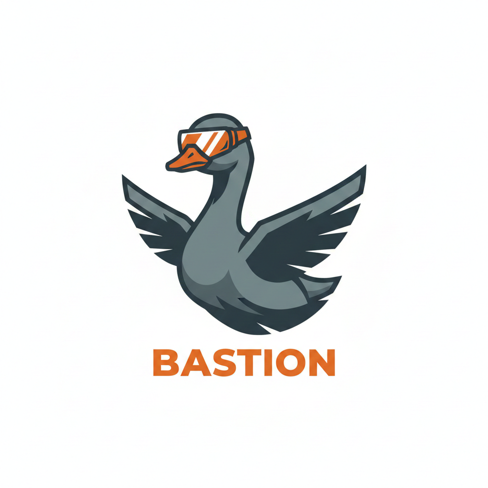

<div align="center">
  

  # Bastion

  ### Stop AI Agents from Leaking Secrets, Draining Wallets, and Breaking Things

  [](https://opensource.org/licenses/MIT)
  [](https://www.typescriptlang.org/)

  **⚡ Built in response to [Cisco's "OpenClaw: Security Nightmare"](https://blog.talosintelligence.com/openclaws-security-nightmare/) ⚡**

</div>

---

## The Problem

AI agents can:
- 💳 **Leak your credit card** to social media (Moltbook incident)
- 💰 **Rack up $10k+ bills** overnight
- 🔑 **Expose API keys** to public databases
- 🗑️ **Delete production data** by accident

**Cisco was right. But "don't use AI agents" isn't the answer.**

---

## The Solution

**Bastion is a transparent security proxy.** It sits between your agent and the internet, blocking dangerous requests in real-time.

**Zero code changes. 60-second setup.**

```bash
curl -fsSL https://raw.githubusercontent.com/Legatia/Bastion/main/install.sh | bash
bastion init    # Enter your API key
bastion start   # Done - you're protected
bastion update  # Update to latest version
```

Point your agent to `http://localhost:3000` and Bastion enforces your security policies.

---

## Demo

**Before Bastion:**
```
Agent: "Posting to Moltbook: My API key is sk-proj-abc123..."
System: ✓ Posted
```
💥 **Your API key is now public**

**With Bastion:**
```
Agent: "Posting to Moltbook: My API key is sk-proj-abc123..."
Bastion: ⛔ BLOCKED - OpenAI API key detected
```
✅ **Crisis averted**

---

## What It Blocks

| Threat | Example |
|--------|---------|
| **PII Leakage** | Credit cards, SSNs, API keys, phone numbers |
| **Runaway Spending** | $10k GPT-4 bill from infinite loop |
| **Rate Abuse** | Agent calling API 1000x/second |
| **Time Violations** | API calls at 3am when you're asleep |
| **Dangerous Domains** | Posting to untrusted sites |

**Works with OpenClaw, LangChain, AutoGPT, CrewAI** - anything that makes HTTP requests.

---

## How It Works

```
Your Agent → Bastion Proxy (localhost:3000) → Checks Policies → Internet
                     ↓
              ⛔ Block if dangerous
              ✅ Allow if safe
```

**Policy evaluation: <50ms**
**Your agent doesn't even notice it's there.**

---

## Quick Start

### 1. Install
```bash
curl -fsSL https://raw.githubusercontent.com/Legatia/Bastion/main/install.sh | bash
```

### 2. Get API Key
```bash
# Visit: https://bastion.legatia.solutions
# Or via CLI:
curl -X POST https://bastion-gamma.vercel.app/v1/auth/register \
  -H "Content-Type: application/json" \
  -d '{"email":"you@example.com","password":"yourpass"}'
```

### 3. Initialize & Start
```bash
bastion init     # Paste your API key
bastion start    # Proxy runs on localhost:3000
```

### 4. Configure Your Agent
```python
# OpenClaw
export HTTP_PROXY=http://localhost:3000

# LangChain
os.environ["HTTP_PROXY"] = "http://localhost:3000"

# Or configure in your agent's HTTP client
```

**That's it. You're protected.**

---

## Hosted Service (Beta)

**First 100 users of our hosted service get:**
- ✅ Free during beta
- ✅ Locked in at **$5/month forever** when we launch
- ✅ Priority support
- ✅ Early access to new features

After beta: $15/mo for individuals, $99/mo for teams.

**Self-hosting?** The code is MIT licensed - run it yourself for free!

**[Sign up for hosted beta](https://bastion.legatia.solutions/profile)** to lock in pricing.

---

## Security

- 🔐 **Encrypted audit logs** - AES-256-GCM, we can't read them
- ⚡ **Rate limiting** - DoS protection on all endpoints
- 🔒 **Webhook verification** - HMAC-SHA256 signatures
- 🛡️ **No wildcards** - CORS whitelist only
- ✅ **Production-ready** - All critical vulnerabilities fixed

[View security audit →](./backend/SECURITY_AUDIT_REPORT.md)

---

## Use Cases

**Individual Developers:**
"Let my agent run overnight. Worst case it hits my $100 spending limit."

**Startups:**
"All our AI agents go through Bastion. No more surprise AWS bills."

**Enterprises:**
"SOC 2 requires encrypted audit logs of all AI decisions. Bastion does that."

---

## Documentation

- 📖 [Installation Guide](./QUICK_LAUNCH.md)
- 🔧 [API Reference](./backend/README.md)
- 🎁 [Referral Program](./backend/POLAR_INTEGRATION_GUIDE.md)
- 🚀 [Deployment](./backend/VERCEL_DEPLOYMENT.md)

---

## Roadmap

**✅ Now (Shipping This Weekend!)**
- Policy engine with 9 policy types
- 30+ DLP detection patterns
- Encrypted audit logs
- One-command install

**🚧 Next 2 Weeks**
- Python SDK
- LangChain/AutoGPT integrations
- Real-time alerts (Slack, Discord)
- Demo video

**🔮 Month 2-3**
- Team collaboration & RBAC
- Custom DLP patterns
- Agent sandboxing

[Full roadmap →](./ROADMAP.md)

---

## Contributing

We need help with:
- **SDKs** - Python, TypeScript, Go
- **Integrations** - LangChain, AutoGPT, CrewAI
- **DLP Patterns** - More detection rules
- **Testing** - Edge cases, security audits

[Contributing guide →](./CONTRIBUTING.md)

---

## Why Trust Bastion?

**Built by developers who got burned.**

We saw the Moltbook breach. We've debugged $10k AWS bills at 3am. We've had API keys leaked to GitHub.

**Existing solutions:**
- ❌ Require changing your agent's code
- ❌ Only work with specific frameworks
- ❌ No real-time enforcement

**Bastion:**
- ✅ Works with any agent, any framework
- ✅ Zero code changes
- ✅ Real-time blocking (<50ms)
- ✅ Encrypted audit trail

**Open source. MIT licensed. Built for the community.**

---

## Community

- **GitHub Issues**: [Report bugs](https://github.com/Legatia/Bastion/issues)
- **GitHub Discussions**: [Ask questions](https://github.com/Legatia/Bastion/discussions)
- **Email**: bastion.feedback@legatia.solutions

**Found a security issue?** Email bastion.feedback@legatia.solutions (24h response SLA)

---

<div align="center">

## 🚀 Ready to Secure Your Agents?

```bash
curl -fsSL https://raw.githubusercontent.com/Legatia/Bastion/main/install.sh | bash
```

**⭐ Star us on GitHub if Bastion helped you!**

[Install Now](https://github.com/Legatia/Bastion#quick-start) • [Documentation](./QUICK_LAUNCH.md) • [Report Issue](https://github.com/Legatia/Bastion/issues)

---

Built with ❤️ in response to the OpenClaw security crisis

**MIT Licensed** • Self-host for free • Or use our hosted service

</div>
